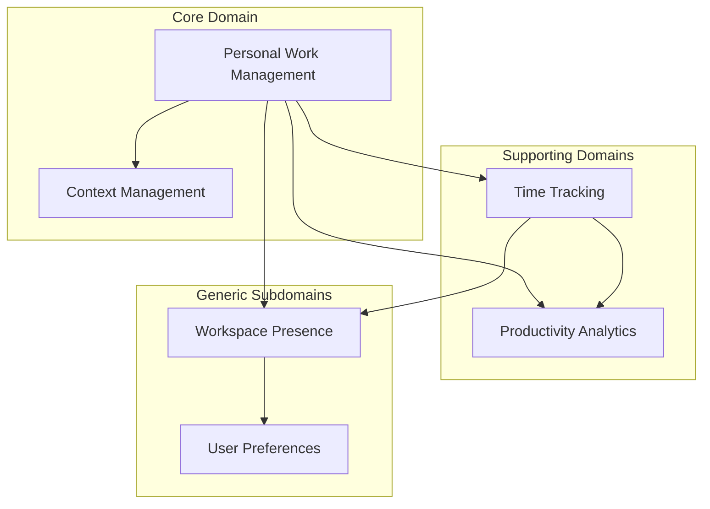
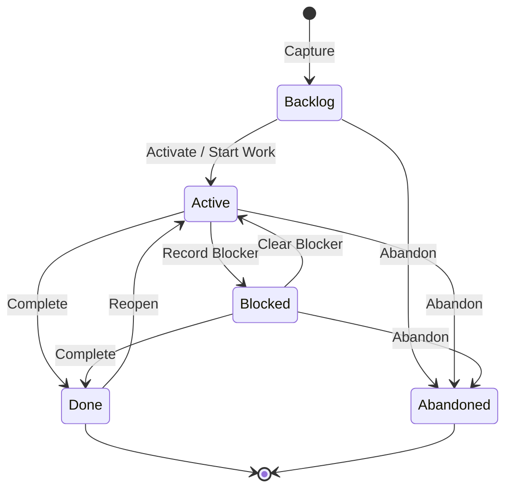
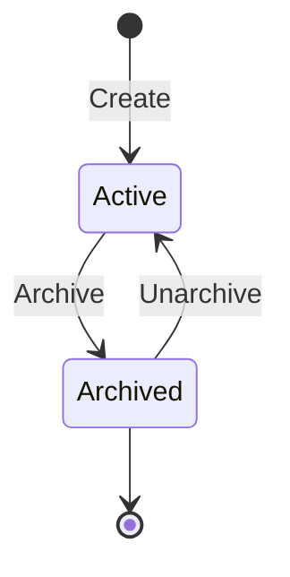
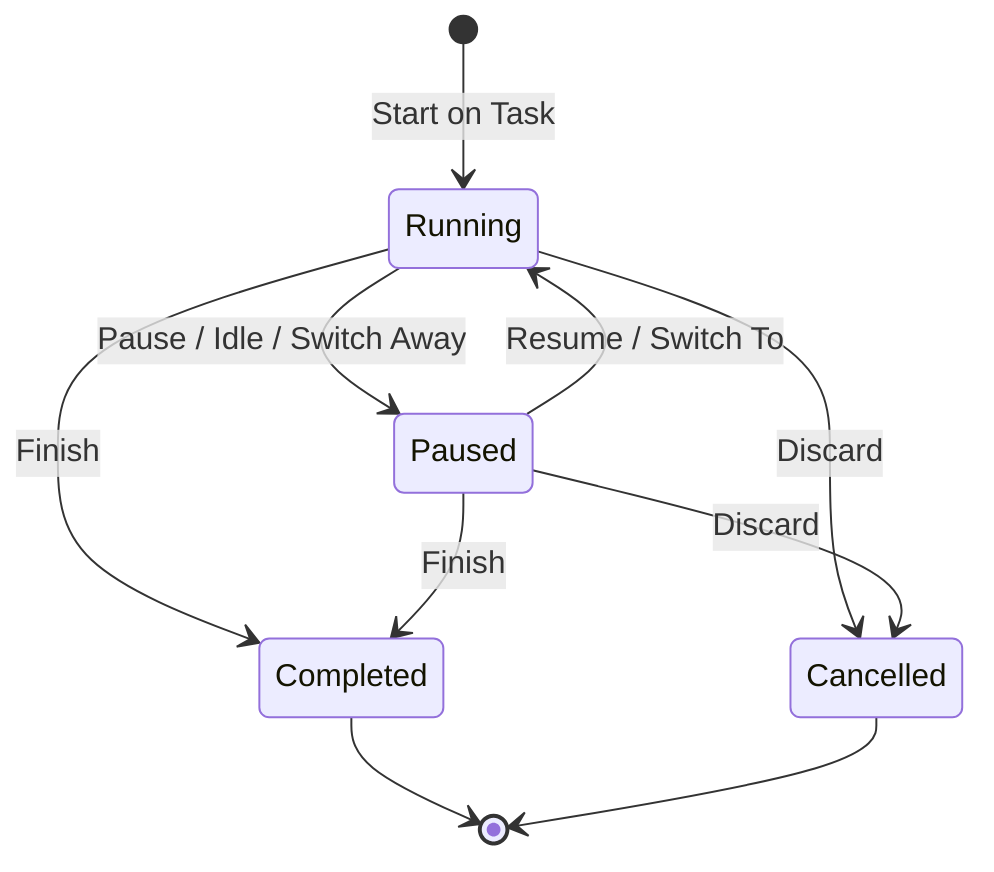
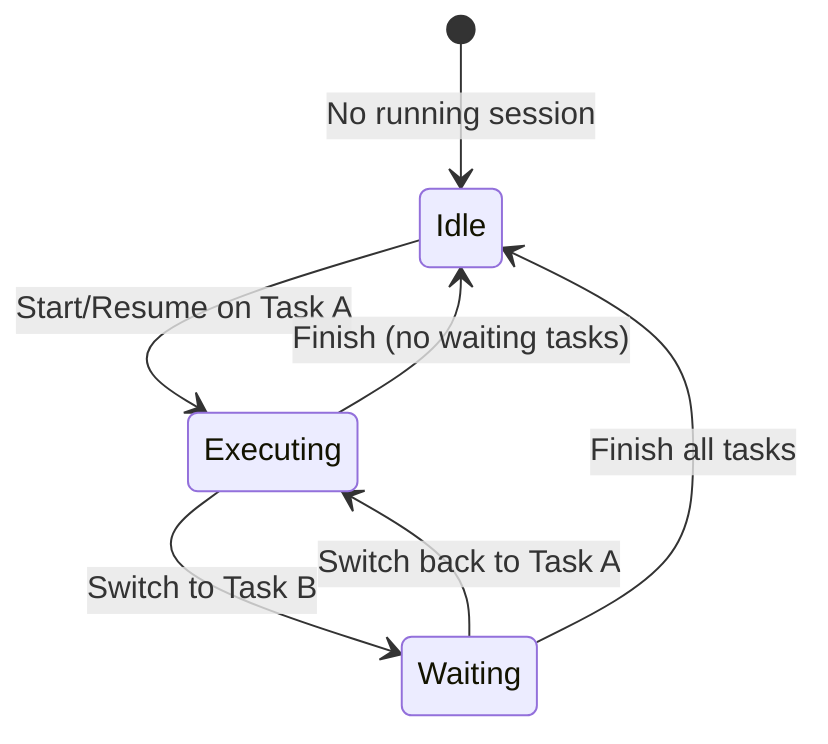

# DOMAIN.md — Jetset V2

> **Personal Productivity Workspace for Knowledge Workers**
>
> Help individuals manage projects, tasks, work sessions, and work context with minimal friction.

---

## 1. Domain Vision

### Purpose

Jetset V2 is a personal desktop workspace that helps knowledge workers **organize parallel work**, **preserve context across interruptions**, and **resume tasks quickly** — while retaining the low-friction time tracking that made Jetset V1 effective.

The primary problem Jetset solves is **context switching cost**: the mental reload required when returning to a task after hours or days. Time tracking remains valuable, but it supports execution rather than defining the product.

### Problem Statement

Knowledge workers routinely juggle multiple projects and tasks — school systems, client work, side projects, ad-hoc requests. Each switch away from a task erodes context: what was done, what comes next, what is blocked. Reloading that context often costs more than doing the work itself.

Jetset reduces that cost by making **Task** the center of the workspace, preserving **working context** between sessions, and attaching **Work Sessions** to execution — not the other way around.

### Target Users

| User | Description |
| ---- | ----------- |
| **Parallel knowledge worker** | A solo professional who actively works on multiple projects and tasks throughout the day and week. |
| **Context-sensitive executor** | Someone who frequently stops and resumes work across days, needing to remember status, next actions, and blockers — not just elapsed time. |
| **Focus-oriented desk worker** | A user who values visible time, countdown focus blocks, daily totals, and lightweight accountability without enterprise tooling overhead. |

### Business Value

| Value | Description |
| ----- | ----------- |
| **Context preservation** | Tasks retain status, progress, next action, blockers, and snapshots so work can resume immediately. |
| **Reduced switching cost** | Active task awareness, resume queue, and quick switching minimize mental reload between parallel work streams. |
| **Organized parallel work** | Optional projects, milestones, and deadlines provide structure without Jira-level ceremony. |
| **Frictionless capture** | Quick tasks can be created in seconds with no project assignment required. |
| **Execution support** | Work sessions measure focused time on a task; countdown mode supports timed focus blocks. |
| **Productivity visibility** | Focus time, daily totals, streaks, momentum, and context-switch patterns provide personal insight. |
| **Proven simplicity** | Single-user, local-first, fast interaction — no accounts, teams, or complex planning structures. |

### Design Principles

| Principle | Rule |
| --------- | ---- |
| **Minimal friction** | Creating and resuming work must take seconds. Jetset is personal, not enterprise. No epics, stories, sprints, story points, or team workflows. |
| **Tasks are first-class** | Task is the primary object. Work sessions exist to support task execution. |
| **Project is optional** | A task may belong to a project or exist independently. Both are valid. |
| **Context preservation** | Every task supports capturing working context for fast resume. |
| **Parallel work is normal** | Multiple active tasks, switching, WIP awareness, and a resume queue are expected — not edge cases. |
| **Single user** | No teams, organizations, managers, or role management. |

---

## 2. Core Business Capabilities

### Work Management (Core)

| Capability | Description |
| ---------- | ----------- |
| **Quick task capture** | Create a standalone task in seconds without assigning a project. |
| **Project task capture** | Create a task within an optional project context. |
| **Task lifecycle** | Manage task status from capture through completion or abandonment. |
| **Subtask breakdown** | Split large tasks into subtasks when needed. |
| **Parallel active tasks** | Maintain multiple active tasks; one may be executing at a time. |
| **Task switching** | Switch execution focus between active tasks with preserved context. |
| **Resume queue** | Surface tasks ready to resume based on recent activity and active status. |
| **Context snapshot** | Capture and restore working context when pausing or switching away from a task. |

### Project Management (Supporting)

| Capability | Description |
| ---------- | ----------- |
| **Create project** | Define a named container for related tasks. |
| **Archive project** | Retire a project from active use without deleting history. |
| **Project deadline** | Set an optional target date for project completion. |
| **Milestone planning** | Define planned milestones with target dates within a project. |
| **Milestone progress** | See milestone completion relative to associated tasks. |

### Context Management (Core)

| Capability | Description |
| ---------- | ----------- |
| **Current status** | Short statement of where the task stands right now. |
| **Last progress** | What was accomplished in the most recent work period. |
| **Next action** | The concrete next step to take when resuming. |
| **Blocker** | What is preventing progress, if anything. |
| **Notes** | Free-form working notes attached to the task. |
| **Context snapshot** | A point-in-time capture of working context at pause, switch, or finish. |

### Time Tracking (Supporting)

| Capability | Description |
| ---------- | ----------- |
| **Work session on task** | Start timed execution attached to a specific task. |
| **Active duration measurement** | Measure productive time from running intervals; exclude paused and idle time. |
| **Session lifecycle** | Start, pause, resume, finish, and discard work sessions. |
| **Countdown focus blocks** | Timed sessions with preset or custom duration and overtime awareness. |
| **Session history** | Review past work sessions by day, linked to their tasks. |
| **Crash recovery** | Recover interrupted sessions without crediting offline gaps. |
| **Idle auto-pause** | Optionally pause when away from the desk. |

### Productivity Analytics (Supporting)

| Capability | Description |
| ---------- | ----------- |
| **Focus time** | Total focused execution time over a chosen period. |
| **Daily productivity** | Per-day summary of productive work and completed tasks. |
| **Activity heatmap** | Visual pattern of work activity over time. |
| **Streaks** | Consecutive days with meaningful productive activity. |
| **Project momentum** | Trend of activity and completion within a project over time. |
| **Context-switch metrics** | Frequency and cost patterns of switching between tasks. |

### Workspace Presence (Generic)

| Capability | Description |
| ---------- | ----------- |
| **Clock display** | Ambient local time and date. |
| **Desktop presence** | Always-on-top, compact mode, system tray, background operation. |
| **Appearance preferences** | Theme, clock format, startup behavior, window layout. |

---

## 3. Actors

| Actor | Role |
| ----- | ---- |
| **User** | The sole operator. Creates and manages projects, tasks, context, and work sessions. Reviews productivity. Configures preferences. No authentication or role separation. |

No Manager, Administrator, Team Member, or external system actors exist in the domain.

---

## 4. Ubiquitous Language

| Term | Definition | Related Terms |
| ---- | ---------- | ------------- |
| **Task** | The primary unit of work. Has a title, optional project, status, context fields, and optional subtasks. May exist without a project. | Quick Task, Project Task, Subtask, Work Session |
| **Quick Task** | A standalone task with no project assignment. Valid for ad-hoc work. | Task, Project |
| **Project Task** | A task associated with a project. | Task, Project |
| **Project** | An optional container grouping related tasks. Has a name, optional deadline, milestones, and archive state. | Milestone, Project Task |
| **Milestone** | A planned checkpoint within a project with a target date and progress visibility. | Project, Task |
| **Subtask** | A child task used to break down work that feels too large. Belongs to a parent task. | Task |
| **Task Status** | The lifecycle state of a task: e.g., Backlog, Active, Blocked, Done, Abandoned. | Task, Blocker |
| **Working Context** | The information needed to resume a task without mental reload. | Context Snapshot, Next Action, Blocker |
| **Current Status** | A short statement of where the task stands at this moment. | Working Context |
| **Last Progress** | What was accomplished in the most recent work on the task. | Working Context, Work Session |
| **Next Action** | The specific step to take when resuming the task. | Working Context, Resume |
| **Blocker** | An obstacle preventing task progress. When present, task may be Blocked. | Task Status, Working Context |
| **Notes** | Free-form text attached to a task for ongoing reference. | Working Context |
| **Context Snapshot** | A point-in-time capture of working context (status, progress, next action, blocker, notes) taken at pause, switch, or finish. | Working Context, Task Switch |
| **Active Task** | A task currently in Active status — eligible for execution or in the resume queue. | Task Status, Work-In-Progress |
| **Work-In-Progress (WIP)** | The set of tasks the user is actively working on across projects. Parallel WIP is normal. | Active Task, Resume Queue |
| **Resume Queue** | An ordered view of active tasks surfaced for quick return, prioritized by recency and readiness. | Active Task, Task Switch |
| **Executing Task** | The task whose work session is currently running. At most one at a time. | Active Task, Work Session |
| **Waiting Task** | An active task with a paused work session — work is in progress but not currently executing. | Task Switch, Work Session |
| **Work Session** | A timed execution period on a specific task. Tracks active duration via work intervals. | Work Interval, Active Duration, Task |
| **Work Interval** | A contiguous segment of running time within a work session. Pause/resume creates interval boundaries. | Active Duration, Pause, Resume |
| **Active Duration** | Total elapsed running time across work intervals. Paused time is excluded. | Work Interval, Focus Time |
| **Focus Time** | Productive execution time attributed to tasks and projects over a period. | Active Duration, Productivity Analytics |
| **Stopwatch Mode** | Work session timer counts up with no preset end. | Work Session, Timer Mode |
| **Countdown Mode** | Work session timer counts down from a configured duration; may continue into overtime. | Work Session, Overtime |
| **Overtime** | Time elapsed after a countdown reaches zero while the session remains running. | Countdown Mode |
| **Finish** | Complete a work session and optionally update task context. | Context Snapshot, Work Session |
| **Task Switch** | Move execution focus from one task to another; prior session is paused and context is preserved. | Waiting Task, Executing Task |
| **Archive** | Retire a project from active use. Tasks and history remain accessible. | Project |
| **Project Deadline** | Optional target date for project completion. | Project, Milestone |
| **Project Momentum** | Trend of activity and completion within a project. | Productivity Analytics, Project |
| **Context Switch** | Moving execution focus from one task to another. Has a measurable frequency and pattern. | Task Switch, Productivity Analytics |
| **Daily Productivity** | Summary of focused work and task activity for a calendar day. | Focus Time, Activity Heatmap |
| **Streak** | Consecutive days with meaningful productive activity. | Daily Productivity |
| **Activity Heatmap** | Visual representation of work intensity over time. | Daily Productivity, Focus Time |
| **Today's Total** | Sum of active durations for non-cancelled work sessions started on the current local day. | Active Duration, Daily Productivity |
| **Heartbeat** | Periodic persistence of last-known activity on a running session for crash recovery. | Recovery |
| **Recovery** | Handling an interrupted work session after unexpected application stop. | Heartbeat, Work Session |

---

## 5. Business Processes

### Process 1: Capture a Quick Task

| Aspect | Detail |
| ------ | ------ |
| **Trigger** | User wants to track ad-hoc work without project setup. |
| **Steps** | 1. User enters a task title. 2. Optionally sets initial next action or notes. 3. Task is created with no project. 4. Task enters Backlog or Active status. |
| **Business Rules** | Title is required. Project assignment is optional — not required for capture. |
| **Result** | A standalone task exists and is ready for execution or later resume. |

---

### Process 2: Create a Project and Project Task

| Aspect | Detail |
| ------ | ------ |
| **Trigger** | User organizes work under a named initiative. |
| **Steps** | 1. User creates a project with name and optional deadline. 2. User adds milestones with target dates (optional). 3. User creates tasks within the project. 4. Tasks inherit project context for filtering and momentum views. |
| **Business Rules** | Project name is required. Milestones belong to one project. Tasks may reference zero or one project. |
| **Result** | Structured work container with trackable milestones and associated tasks. |

---

### Process 3: Break Down a Task with Subtasks

| Aspect | Detail |
| ------ | ------ |
| **Trigger** | A task feels too large to execute as a single unit. |
| **Steps** | 1. User selects a parent task. 2. User adds one or more subtasks. 3. Subtasks may be executed independently. 4. Parent task progress reflects subtask completion. |
| **Business Rules** | Subtasks belong to exactly one parent task. Subtasks do not require a project (inherit context from parent). |
| **Result** | Work is decomposed into manageable execution units without introducing epic/story hierarchy. |

---

### Process 4: Start Work on a Task

| Aspect | Detail |
| ------ | ------ |
| **Trigger** | User selects a task and begins execution. |
| **Steps** | 1. User selects an active or backlog task. 2. User chooses stopwatch or countdown mode (optional duration). 3. If another session is running, it is auto-paused and its context snapshot is captured. 4. A work session is created on the selected task. 5. Task status moves to Active if not already. 6. UI shows executing task with timer. |
| **Business Rules** | A work session belongs to exactly one task. Only one session may be running at a time. Starting a new session pauses the current running session. |
| **Result** | Task execution begins with time tracking attached. |

---

### Process 5: Preserve Context on Pause or Switch

| Aspect | Detail |
| ------ | ------ |
| **Trigger** | User pauses, switches tasks, or finishes a session. |
| **Steps** | 1. User updates context fields (status, last progress, next action, blocker, notes) — minimally prompted, never blocking. 2. System captures a context snapshot with timestamp. 3. Work session is paused or finished as appropriate. 4. Task context is persisted for future resume. |
| **Business Rules** | Context capture is encouraged but never mandatory — friction must remain minimal. Snapshots are append-only history; latest context fields reflect current state. |
| **Result** | Task can be resumed later without mental reload. |

---

### Process 6: Switch Between Active Tasks

| Aspect | Detail |
| ------ | ------ |
| **Trigger** | User moves execution focus to a different active task. |
| **Steps** | 1. Current executing session is paused; context snapshot captured. 2. Target task's work session is resumed (or a new session started). 3. Executing task changes; prior task enters Waiting state. 4. Resume queue updates. |
| **Business Rules** | Gap between sessions is not counted as active time for either task. Both tasks remain in WIP. Context is preserved for both. |
| **Result** | Parallel work continues with minimal switching cost. |

---

### Process 7: Resume a Task from Context

| Aspect | Detail |
| ------ | ------ |
| **Trigger** | User returns to a task after hours or days. |
| **Steps** | 1. User selects task from resume queue, project list, or search. 2. System displays current context: status, last progress, next action, blocker, notes. 3. User optionally reviews recent context snapshots. 4. User starts or resumes work session. 5. Mental reload time is minimized. |
| **Business Rules** | Resume queue prioritizes active tasks by recency and blocked/unblocked state. Stale context is still shown — user may update on resume. |
| **Result** | User re-enters work with full situational awareness. |

---

### Process 8: Complete a Task

| Aspect | Detail |
| ------ | ------ |
| **Trigger** | User marks work as done. |
| **Steps** | 1. Any open work session is finished with optional final context update. 2. Task status moves to Done. 3. Subtasks must be Done or explicitly abandoned. 4. Project milestone progress updates if applicable. 5. Task leaves active WIP and resume queue. |
| **Business Rules** | Done tasks retain all context snapshots and session history. Done tasks may be reopened to Active if needed. |
| **Result** | Task is closed; project and analytics reflect completion. |

---

### Process 9: Manage Project Milestones

| Aspect | Detail |
| ------ | ------ |
| **Trigger** | User plans or reviews project progress. |
| **Steps** | 1. User defines milestones with name and target date. 2. User associates tasks with milestones (optional). 3. System shows milestone progress based on linked task completion. 4. User adjusts milestones as plans evolve. |
| **Business Rules** | Milestones are lightweight checkpoints — not sprints or releases. Overdue milestones are visible but do not block work. |
| **Result** | Project progress is visible without heavyweight planning. |

---

### Process 10: Review Productivity

| Aspect | Detail |
| ------ | ------ |
| **Trigger** | User wants insight into work patterns. |
| **Steps** | 1. User views daily productivity summary (focus time, sessions, tasks touched). 2. User explores activity heatmap, streaks, and project momentum. 3. User reviews context-switch frequency and patterns. 4. User navigates session history by day, filtered by task or project. |
| **Business Rules** | Analytics reflect completed and active work sessions; cancelled sessions are excluded. Metrics are personal — no comparison to others. |
| **Result** | User gains visibility into focus, momentum, and switching behavior. |

---

### Process 11: Archive a Project

| Aspect | Detail |
| ------ | ------ |
| **Trigger** | A project is complete or no longer active. |
| **Steps** | 1. User archives the project. 2. Project moves out of active project lists. 3. Tasks, sessions, and history remain accessible. 4. Active tasks in the project should be completed or reassigned first (soft guidance, not enforced). |
| **Business Rules** | Archive is reversible. Archived projects do not appear in default WIP views. |
| **Result** | Workspace stays focused on current work without data loss. |

---

### Process 12: Recover Interrupted Session

| Aspect | Detail |
| ------ | ------ |
| **Trigger** | Application restarts with an in-progress work session. |
| **Steps** | 1. System detects unfinished session linked to a task. 2. User chooses: continue (gap excluded), finish at last known activity, or discard. 3. Task context remains intact regardless of recovery choice. |
| **Business Rules** | Crash/offline gap is never counted as active time. Task context is independent of session recovery outcome. |
| **Result** | Session is cleanly resumed, closed, or cancelled; task remains resumable. |

---

## 6. Domain Model

### Core Domain: Personal Work Management

**Responsibility:** Organize work, preserve context, track progress, support execution, and reduce context switching cost.

This is the heart of Jetset V2. All other domains exist to support it.

---

### Supporting Domains

| Domain | Responsibility |
| ------ | -------------- |
| **Time Tracking** | Measure focused execution via work sessions and intervals. |
| **Productivity Analytics** | Derive personal insight from execution history. |
| **Workspace Presence** | Clock, tray, compact mode, notifications, preferences. |

---

### Aggregates

#### Task (Aggregate Root) — Core

The central aggregate. Owns working context, subtasks, and references work sessions.

| Attribute | Description |
| --------- | ----------- |
| Identity | Unique identifier |
| Title | Required label |
| Project Id | Optional reference to a project |
| Status | Backlog, Active, Blocked, Done, Abandoned |
| Current Status | Short statement of present state |
| Last Progress | Most recent accomplishment |
| Next Action | Concrete resume step |
| Blocker | Optional obstacle description |
| Notes | Free-form working notes |
| Created At | Capture timestamp |
| Updated At | Last context or status change |
| Completed At | Set when Done |

**Children:** Subtask (optional, one-to-many), Context Snapshot (one-to-many, append-only)

**References:** Work Session (one-to-many, owned by Time Tracking context)

**Invariants:**
- Title is required.
- Project Id is optional (Decision A).
- Subtasks belong to this task only (Decision B).
- At most one executing work session system-wide; task may have multiple paused sessions over time but one in-progress session at a time.

---

#### Project (Aggregate Root) — Core

Groups related tasks and milestones.

| Attribute | Description |
| --------- | ----------- |
| Identity | Unique identifier |
| Name | Required label |
| Description | Optional summary |
| Deadline | Optional target completion date |
| Status | Active, Archived |
| Created At | Creation timestamp |
| Archived At | Set on archive |

**Children:** Milestone (one-to-many)

**Invariants:**
- Name is required.
- Archived projects are read-only for task creation (soft rule — existing tasks remain accessible).
- Milestones belong to this project only.

---

#### Work Session (Aggregate Root) — Supporting (Time Tracking)

A timed execution period on a task. Retains V1 proven model.

| Attribute | Description |
| --------- | ----------- |
| Identity | Unique identifier |
| Task Id | Required reference to executing task (Decision C) |
| Mode | Stopwatch or Countdown |
| State | Running, Paused, Completed, Cancelled |
| Started At | Session start timestamp |
| Finished At | Set on complete or cancel |
| Countdown Duration | Planned duration (countdown only) |
| Countdown Remaining | Stored remaining when paused |
| Countdown Ends At | Absolute end while running |
| Last Heartbeat At | Recovery timestamp |
| Session Note | Optional annotation on finish |

**Children:** Work Interval (one-to-many)

**Invariants:**
- Must reference a Task (Decision C).
- Only one session may be Running at a time.
- Active duration is derived from intervals; paused time excluded.
- Cancelled sessions excluded from productivity totals.

---

### Entities

| Entity | Aggregate | Description |
| ------ | --------- | ----------- |
| **Task** | Task | Primary work unit with context and status. |
| **Subtask** | Task | Child task for breakdown; shares parent's project context. |
| **Context Snapshot** | Task | Point-in-time capture of working context. |
| **Project** | Project | Optional work container with deadline. |
| **Milestone** | Project | Planned checkpoint with target date. |
| **Work Session** | Work Session | Timed execution on a task. |
| **Work Interval** | Work Session | Running time segment. |
| **App Setting** | — (Preferences) | Key-value user preference. |

---

### Value Objects

| Value Object | Description |
| ------------ | ----------- |
| **Task Status** | Backlog, Active, Blocked, Done, Abandoned |
| **Project Status** | Active, Archived |
| **Timer Mode** | Stopwatch, Countdown |
| **Session State** | Running, Paused, Completed, Cancelled |
| **Active Duration** | Computed `TimeSpan` from interval sum |
| **Working Context** | Composite of Current Status, Last Progress, Next Action, Blocker, Notes |
| **Preset Duration** | Standard countdown lengths (5, 15, 25, 45, 60 minutes) |
| **Focus Period** | Date-bounded window for analytics queries |
| **Streak** | Consecutive productive days count |
| **Momentum Score** | Derived project activity trend (analytics concept, not stored) |

---

### Business Events

| Event | When | Effect |
| ----- | ---- | ------ |
| **Task Captured** | Quick or project task created | New task in Backlog or Active |
| **Task Activated** | Task moved to Active | Enters WIP and resume queue |
| **Task Blocked** | Blocker recorded | Status → Blocked |
| **Task Unblocked** | Blocker cleared | Status → Active |
| **Task Completed** | User marks done | Status → Done; leaves WIP |
| **Subtask Added** | User breaks down task | New child under parent |
| **Context Updated** | User edits context fields | Task context refreshed |
| **Context Snapshot Taken** | Pause, switch, or finish | Append-only snapshot recorded |
| **Project Created** | User defines project | New active project |
| **Project Archived** | User retires project | Status → Archived |
| **Milestone Defined** | User adds checkpoint | New milestone under project |
| **Milestone Reached** | All linked tasks done | Milestone marked complete |
| **Work Session Started** | Execution begins on task | Session + first interval; prior session paused |
| **Work Session Paused** | Manual, idle, or switch | Interval closed; snapshot encouraged |
| **Work Session Resumed** | Resume or switch-to | New interval opened |
| **Work Session Finished** | User completes session | Interval closed; session → Completed |
| **Task Switched** | Execution focus moved | Prior paused; target resumed |
| **Session Recovered** | App restart with open session | Recovery dialog presented |
| **Productivity Period Closed** | Local day ends | Daily totals and streaks evaluated |

---

### Policies

| Policy | Rule |
| ------ | ---- |
| **Single Runner** | At most one work session in Running state at any time. |
| **Task-First Execution** | Every work session must belong to a task. Ad-hoc work requires a quick task first. |
| **Optional Project** | Tasks and projects are loosely coupled. No task requires a project. |
| **Minimal Context Friction** | Context capture is offered at natural breakpoints but never blocks workflow. |
| **Parallel WIP Allowed** | Multiple tasks may be Active simultaneously; one executes at a time. |
| **Active Duration Integrity** | Only running interval time counts; pauses, idle gaps, and cancelled sessions excluded. |
| **Snapshot Append-Only** | Context snapshots are never edited or deleted; they form a resume history. |
| **Blocked Visibility** | Blocked tasks remain in WIP but are visually distinct in resume queue. |
| **Archive Soft Guard** | Archiving a project with active tasks is allowed but surfaced as a warning. |
| **Crash Gap Exclusion** | Recovery never credits offline time as active duration. |
| **Single User Local** | All data belongs to one user on one machine; no sharing or sync in domain scope. |
| **No Enterprise Hierarchy** | No epics, sprints, story points, or team structures — subtasks are the only breakdown mechanism. |

---

## 7. Business Rules

### Task Rules

| ID | Rule |
| -- | ---- |
| **BR-T01** | Task title is required. |
| **BR-T02** | Project Id is optional; a task may exist without a project. |
| **BR-T03** | A task may have zero or more subtasks. Subtasks inherit the parent's project context. |
| **BR-T04** | Task status transitions: Backlog → Active → Done; Active ↔ Blocked; any → Abandoned. |
| **BR-T05** | A blocked task must have a blocker recorded; clearing the blocker returns task to Active. |
| **BR-T06** | Completing a parent task with open subtasks requires explicit confirmation or subtask completion. |
| **BR-T07** | Done tasks retain all context snapshots and session history. |
| **BR-T08** | Reopening a Done task returns it to Active and re-enters WIP. |

### Context Rules

| ID | Rule |
| -- | ---- |
| **BR-C01** | Context fields (status, progress, next action, blocker, notes) are optional individually but collectively form Working Context. |
| **BR-C02** | A context snapshot is captured at pause, switch, and finish — user may skip editing fields. |
| **BR-C03** | Snapshots are immutable once recorded. |
| **BR-C04** | Latest context field values always reflect the most recent user update or snapshot. |
| **BR-C05** | Next Action is the primary resume aid; the resume view highlights it prominently. |

### Project Rules

| ID | Rule |
| -- | ---- |
| **BR-P01** | Project name is required. |
| **BR-P02** | Project deadline is optional. |
| **BR-P03** | Milestones require a name; target date is optional. |
| **BR-P04** | Milestone progress is derived from linked task completion, not manual percentage entry. |
| **BR-P05** | Archiving a project hides it from active lists; data is preserved. |
| **BR-P06** | Archived projects cannot receive new tasks (existing tasks remain accessible). |

### Work Session Rules

| ID | Rule |
| -- | ---- |
| **BR-W01** | Every work session must reference a task. |
| **BR-W02** | Only one work session may be Running at a time. |
| **BR-W03** | Starting a session on a new task auto-pauses the currently running session. |
| **BR-W04** | Active duration equals the sum of work interval lengths; paused time excluded. |
| **BR-W05** | Pause closes the open interval; resume opens a new interval. |
| **BR-W06** | Cancelled sessions are excluded from productivity totals. |
| **BR-W07** | Crash recovery never credits offline gap as active time. |
| **BR-W08** | Countdown sessions store remaining time when paused; overtime continues accumulation after zero. |
| **BR-W09** | In-progress sessions cannot be deleted; must be finished or discarded first. |

### Analytics Rules

| ID | Rule |
| -- | ---- |
| **BR-A01** | Focus time aggregates active duration from non-cancelled sessions. |
| **BR-A02** | Daily productivity is scoped to the user's local calendar day. |
| **BR-A03** | Streaks count consecutive local days with focus time above a meaningful threshold. |
| **BR-A04** | Context-switch metrics count task-switch events within a period. |
| **BR-A05** | Project momentum reflects session activity and task completions over rolling windows. |
| **BR-A06** | Analytics are personal and local; no team benchmarks or comparisons. |

---

## 8. Bounded Contexts

### Context 1: Personal Work Management (Core)

| Aspect | Detail |
| ------ | ------ |
| **Purpose** | Organize tasks and projects; manage parallel WIP; support task switching and resume. |
| **Responsibilities** | Task CRUD; project CRUD; subtask breakdown; status lifecycle; WIP and resume queue; archive. |
| **Aggregates** | Task, Project |
| **Collaborators** | Context Management, Time Tracking |

---

### Context 2: Context Management (Core)

| Aspect | Detail |
| ------ | ------ |
| **Purpose** | Preserve and restore working context to reduce mental reload. |
| **Responsibilities** | Maintain context fields; capture snapshots; serve resume views; highlight next actions. |
| **Aggregates** | Task (context portion), Context Snapshot |
| **Collaborators** | Personal Work Management, Time Tracking |

---

### Context 3: Time Tracking (Supporting)

| Aspect | Detail |
| ------ | ------ |
| **Purpose** | Measure focused execution time on tasks. |
| **Responsibilities** | Session lifecycle; interval management; countdown/overtime; idle auto-pause; crash recovery; session history. |
| **Aggregates** | Work Session |
| **Collaborators** | Personal Work Management (task reference), Productivity Analytics |

---

### Context 4: Productivity Analytics (Supporting)

| Aspect | Detail |
| ------ | ------ |
| **Purpose** | Provide personal insight into work patterns and momentum. |
| **Responsibilities** | Compute focus time, daily totals, heatmaps, streaks, project momentum, context-switch metrics. |
| **Aggregates** | None (read models derived from Task and Work Session history) |
| **Collaborators** | Time Tracking, Personal Work Management |

---

### Context 5: Workspace Presence (Generic)

| Aspect | Detail |
| ------ | ------ |
| **Purpose** | Keep the workspace accessible on the desktop with minimal footprint. |
| **Responsibilities** | Clock display; system tray; compact mode; notifications; always-on-top; window persistence. |
| **Aggregates** | None |
| **Collaborators** | User Preferences, Time Tracking (status display) |

---

### Context 6: User Preferences (Generic)

| Aspect | Detail |
| ------ | ------ |
| **Purpose** | Persist personal display and behavior settings. |
| **Responsibilities** | Theme, clock format, idle settings, startup behavior, window bounds. |
| **Aggregates** | App Setting |
| **Collaborators** | All contexts (read-only configuration) |

---

### Context Map Relationships

| Upstream | Downstream | Relationship |
| -------- | ---------- | ------------ |
| Personal Work Management | Time Tracking | **Customer-Supplier** — PWM defines tasks; TT executes sessions on them |
| Personal Work Management | Context Management | **Partnership** — context is integral to task aggregate |
| Time Tracking | Productivity Analytics | **Conformist** — analytics consumes session data as published |
| Personal Work Management | Productivity Analytics | **Conformist** — analytics consumes task/project data as published |
| User Preferences | All | **Shared Kernel** (configuration) — settings apply cross-cutting |

---

## 9. State Models

### Task Lifecycle

---

### Project Lifecycle

---

### Work Session Lifecycle

---

### Execution Focus (Cross-Aggregate)

One task executes (Running session); others may wait (Paused sessions) with preserved context.

---

## 10. Domain Insights

### Strategic Positioning

Jetset V2 occupies the space between **flat timers** (insufficient context) and **project management tools** (excessive ceremony). The domain is deliberately constrained to personal, parallel, context-rich work — not team delivery management.

### Key Modeling Decisions

| Decision | Implication |
| -------- | ----------- |
| **A — Project optional** | Task aggregate does not require Project; queries and UI must treat unassigned tasks as first-class. |
| **B — Subtasks allowed** | Task aggregate may contain child tasks; one level of breakdown only — no deep hierarchy. |
| **C — Session belongs to Task** | Work Session aggregate holds Task Id; starting a session requires a task (even a quick-captured one). |
| **D — Context Snapshot** | Append-only snapshot entity under Task; powers resume and history of working state. |
| **E — Single user** | No multi-tenancy, sharing, or permission concepts anywhere in the model. |

### Architectural Implications

- **Task replaces Work Session as the aggregate root of the core domain.** Work Session moves to a supporting context.
- **Context is part of the Task aggregate**, not a separate microservice — snapshots are children of Task.
- **Resume Queue is a read model**, not an aggregate — derived from Active tasks ordered by recency and context freshness.
- **Productivity Analytics is entirely derived** — no analytics aggregates; query over Task and Work Session history.
- **V1 session mechanics are preserved** within Time Tracking — intervals, heartbeat, idle auto-pause, countdown/overtime remain valid supporting capabilities.

### Domain Complexity

| Area | Complexity | Notes |
| ---- | ---------- | ----- |
| Context preservation | Medium | Snapshot history, field updates, resume views |
| Parallel WIP + switching | Medium | Cross-aggregate coordination between Task and Work Session |
| Optional project hierarchy | Low–Medium | Project → Milestone → Task, all optional layers |
| Subtask breakdown | Low | One-level parent-child; no deep trees |
| Time tracking (inherited V1) | Medium | Intervals, countdown, recovery, idle — proven |
| Productivity analytics | Medium | Read models over historical data |
| Overall | Medium | Broader than V1 but bounded by single-user, no-enterprise constraints |

### Explicit Non-Goals

| Non-Goal | Rationale |
| -------- | --------- |
| Team collaboration | Personal tool (Decision E) |
| Epics, sprints, story points | Minimal friction (Principle 1) |
| Cloud sync / accounts | Single-user local scope |
| Billing / invoicing | Outside productivity workspace scope |
| Calendar integration | Future consideration, not core domain |
| AI-generated context | Future consideration, not core domain |

---

*Domain model for Jetset V2 — designed around personal productivity, task execution, context preservation, and project awareness with low-friction workflow.*
