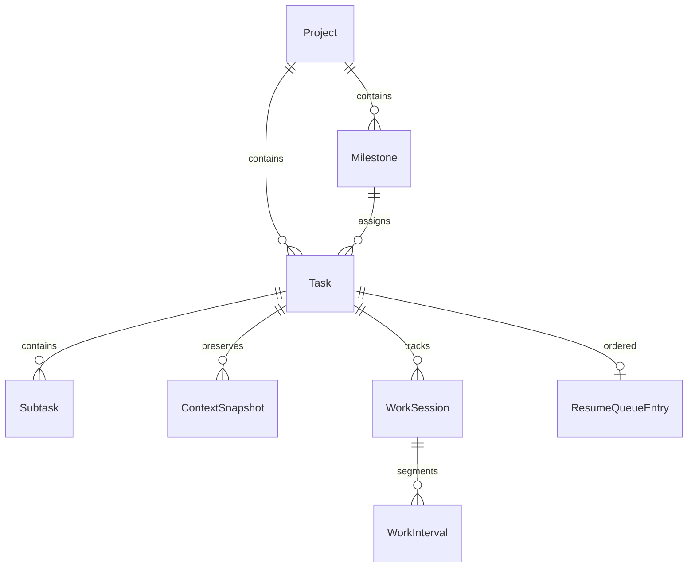
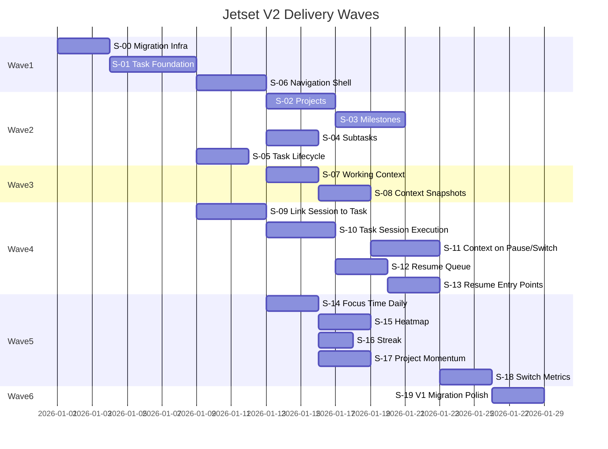

# Jetset V2 Implementation Plan

**Version:** 1.0  
**Status:** Approved Artifact  
**Source of Truth:** [DOMAIN.md](./DOMAIN.md)  
**Date:** 2026-08-22

---

## Executive Summary

Jetset today is a **V1 personal work-session timer**: WPF/.NET 10, SQLite, MVVM. It tracks stopwatch/countdown sessions with pause/resume, parallel paused sessions ("Waiting"), daily totals, and history. It has **no first-class domain model** for projects, tasks, milestones, context, or analytics.

V2 transforms Jetset into a **Personal Productivity Workspace** while preserving the strong session engine. This plan uses **Vertical Slice Architecture**: each slice delivers one user-visible capability end-to-end (schema → service → UI → tests), organized into incremental delivery waves.

**Scope:** Implement ONLY Jetset V2 capabilities described in DOMAIN.md.  
**Excluded:** Context Reload Score, Context Freshness, Resume Recommendation, Stale Task Detection, WIP Health Score, Focus Capacity Monitoring, Productivity Coaching, AI Features, and any V3+ roadmap capability.

---

# 1. Current State Analysis

## 1.1 Architecture

| Layer | Technology | Notes |
|---|---|---|
| Runtime | .NET 10 (`net10.0-windows`) | Windows desktop only |
| UI | WPF + MVVM | Manual `ObservableObject` / `RelayCommand` |
| Persistence | SQLite via `Microsoft.Data.Sqlite` | `%LocalAppData%\Jetset\jetset.db` |
| Schema | Inline DDL in `SchemaInitializer` | No versioned migrations |
| Tests | xUnit | Session logic only |
| Composition | `AppServices.cs` | Single composition root |

No web API, no EF Core, no multi-user auth — intentionally single-user desktop.

## 1.2 Existing Database Schema

Three tables in `SchemaInitializer.cs`:

**WorkSession** — session-centric, free-text `TaskName` (not a FK):

```sql
CREATE TABLE IF NOT EXISTS WorkSession (
    Id TEXT PRIMARY KEY NOT NULL,
    TaskName TEXT NOT NULL,
    Mode INTEGER NOT NULL,
    StartedAt TEXT NOT NULL,
    FinishedAt TEXT NULL,
    CountdownDurationTicks INTEGER NULL,
    State INTEGER NOT NULL,
    Note TEXT NULL,
    LastHeartbeatAt TEXT NULL,
    CountdownEndsAt TEXT NULL,
    CountdownRemainingTicks INTEGER NULL,
    CountdownCompletedNotified INTEGER NOT NULL DEFAULT 0
);
```

**WorkInterval** — active-duration segments (pause-aware).

**AppSetting** — key/value preferences.

## 1.3 Existing Domain Objects

| Object | Location | Purpose |
|---|---|---|
| `WorkSession` | `Models/WorkSession.cs` | Timer session with `TaskName` string |
| `WorkInterval` | `Models/WorkInterval.cs` | Focused work segments |
| `AppSettings` | `Models/AppSettings.cs` | UI/theme/idle preferences |
| `SessionState` | enum: Running, Paused, Completed, Cancelled | Session lifecycle |
| `TimerMode` | enum: Stopwatch, Countdown | Session mode |

No `Project`, `Milestone`, `Task`, `Subtask`, or `ContextSnapshot` types exist.

## 1.4 Existing Services

| Service | Capability |
|---|---|
| `SessionService` | Start/pause/resume/finish/discard, `SwitchTo`, parallel sessions, recovery, daily totals |
| `SettingsService` | App preferences |
| `IdleAutoPauseController` | Auto pause on idle/lock/sleep |
| `ClockService` | Testable time |
| `NotificationService`, `TrayService`, `StartupService` | Desktop UX |

`SessionService` is the core asset: one running session, multiple paused, interval-based active duration, crash recovery.

## 1.5 Existing UI Screens

| Screen | Files | Capability |
|---|---|---|
| Main Window | `MainWindow.xaml` | Clock, timer, start panel, Waiting list, today total |
| History | `Views/HistoryWindow.xaml` | Single-day session list, edit, delete |
| Settings | `Views/SettingsWindow.xaml` | Theme, idle, startup, window prefs |
| Finish Note Dialog | `Views/FinishNoteDialog.xaml` | Optional session note |
| Recovery Dialog | `Views/RecoveryDialog.xaml` | Post-crash recovery |

No project views, task boards, context panels, resume queue view, or analytics dashboard.

## 1.6 Existing Capabilities by V2 Domain Area

| V2 Capability | Current State | Evidence |
|---|---|---|
| **Quick Task** | Partial | Free-text name at session start only; no persisted task |
| **Project Task** | Missing | No project entity |
| **Task Lifecycle** | Missing | Session states only, not task states |
| **Subtasks** | Missing | — |
| **Projects** | Missing | — |
| **Milestones** | Missing | — |
| **Milestone Progress** | Missing | — |
| **Working Context** | Missing | Session finish `Note` only |
| **Context Snapshot** | Missing | — |
| **Active / Waiting Task** | Partial | Paused sessions ≈ waiting work, but session-centric |
| **Task Switching** | Partial | `SessionService.SwitchTo()` + Waiting UI |
| **Resume Queue** | Partial | Waiting panel; no ordering, no context, not task-centric |
| **Stopwatch Session** | Complete | — |
| **Countdown Session** | Complete | Presets 5/15/25/45/60 + custom |
| **Active Duration** | Complete | `WorkInterval`-based |
| **Session History** | Complete | History window |
| **Focus Time** | Partial | Daily total only (`GetTodaysTotal`) |
| **Daily Productivity** | Partial | Main window + history header |
| **Heatmap / Streak / Momentum / Switch Metrics** | Missing | — |

## 1.7 Test Coverage

- `SessionServiceTests.cs` — session lifecycle, parallel sessions, switch, recovery, totals
- `IdleAutoPauseControllerTests.cs` — idle behavior

No tests for UI or any V2 domain.

---

# 2. Gap Analysis

## 2.1 Domain Model Gaps

| DOMAIN.md Entity | Gap |
|---|---|
| **Project** | No entity, store, service, or UI |
| **Milestone** | No entity; no progress derivation |
| **Task** | No first-class entity; `TaskName` is ephemeral per session |
| **Subtask** | No entity |
| **ContextSnapshot** | No entity or capture workflow |
| **WorkSession → Task** | Sessions not linked to tasks |

## 2.2 Process Gaps (DOMAIN.md §5)

| Process | Gap |
|---|---|
| **Capture Work** | Can start a session with a name; cannot create/manage tasks independently |
| **Plan Work** | No project/milestone/subtask planning |
| **Execute Work** | Session execution works; not task-aware |
| **Pause Work** | Pause works; no context snapshot |
| **Switch Work** | Session switch works; no context preservation or resume queue update |
| **Resume Work** | Can switch to paused session; no context display, no task/project/search entry |
| **Complete Work** | Session finish works; no task Done state or milestone progress |
| **Review Productivity** | Daily total only; no heatmap, streak, momentum, switch metrics |

## 2.3 Infrastructure Gaps

1. **No schema versioning** — `CREATE TABLE IF NOT EXISTS` cannot evolve safely
2. **No task/project service layer** — everything is session-centric
3. **No navigation shell** — single main window + modals cannot scale to V2 screens
4. **No analytics aggregation** — only raw daily session queries
5. **No search** — required for Process 6 resume entry point

## 2.4 What Can Be Reused (Foundation Assets)

- `SessionService` engine (intervals, pause, countdown, recovery)
- `ISessionStore` / `InMemorySessionStore` test pattern
- MVVM infrastructure, themes, tray, idle auto-pause
- History editing patterns
- Existing keyboard shortcuts and compact mode

---

# 3. Domain Mapping

## 3.1 V1 → V2 Concept Mapping

| V1 Concept | V2 Mapping | Action |
|---|---|---|
| `WorkSession.TaskName` | `Task.Title` | Migrate to FK; keep denormalized cache optional |
| Session `Note` | Session note (unchanged) + Task `Notes` / Context | Separate concerns |
| Waiting sessions panel | Resume Queue (subset) | Evolve to task-centric ordered queue |
| `SessionService.SwitchTo()` | Process 5 — Switch Work | Extend with context snapshot |
| `GetTodaysTotal()` | Focus Time / Daily Productivity | Extend aggregation layer |
| History window | Session History (unchanged) + analytics views | Keep; add dashboard |
| Start panel (task name textbox) | Quick Task capture | Replace with task picker/create |
| `SessionState` | Session lifecycle (unchanged) | Distinct from `TaskStatus` |
| — | `TaskStatus`: Active, Blocked, Done, Cancelled | New enum |

## 3.2 V2 Entity Relationship (Target)



## 3.3 Resume Queue Design Decision

DOMAIN.md defines Resume Queue as an **ordered list of active tasks ready for continuation**.

**Recommendation:** Derive queue from task state + session state rather than a separate mutable queue table initially:

- Include tasks with `Status = Active` that have a paused in-progress session OR were recently worked on
- Order by `LastWorkedAt DESC` (maintained on session pause/switch)
- Optional `ResumeQueueEntry` table in a later slice if manual reordering is needed

This satisfies DOMAIN.md without over-engineering; manual reorder can be a follow-up slice if needed.

## 3.4 Context Model Design Decision

DOMAIN.md distinguishes:

- **Working Context** (live fields on Task): Current Status, Last Progress, Next Action, Blocker, Notes
- **Context Snapshot** (point-in-time history on pause/switch/complete)

**Recommendation:** Store live context on `Task`; append `ContextSnapshot` rows on pause/switch/session finish. Latest snapshot mirrors task context at capture time.

---

# 4. Implementation Strategy

## 4.1 Architectural Approach

**Vertical Slice Architecture** — each slice owns:

```
Slice/
├── Persistence/   (migration + store methods)
├── Models/        (domain types)
├── Services/      (business logic)
├── ViewModels/    (presentation logic)
├── Views/         (XAML)
└── Tests/         (service-level tests)
```

Slices are independently reviewable and mergeable. Shared infrastructure (migration runner, navigation shell) is extracted only when a second slice needs it.

## 4.2 Guiding Principles (from DOMAIN.md)

- **Minimal friction** — quick task creation in seconds; preserve keyboard-first flows
- **Task first** — task is the primary navigation unit
- **Project optional** — nullable `ProjectId` on Task
- **Context preservation** — snapshot on pause/switch
- **Single user** — no auth, roles, or multi-tenancy
- **Scope discipline** — exclude all V3+ capabilities listed in DOMAIN.md §6

## 4.3 Migration Strategy

Replace bare `SchemaInitializer` with a **versioned migration runner**:

1. Add `SchemaVersion` table
2. Numbered migration classes (`Migration001_...`, etc.)
3. Run pending migrations on startup
4. **Migration V2-001:** Add `Task`, `Project`, etc.
5. **Migration V2-00N:** Add `TaskId` to `WorkSession`; backfill existing sessions as standalone quick tasks

Backfill rule: each distinct historical `TaskName` → one `Task` (Active or Done based on session state); link sessions via `TaskId`.

## 4.4 UI Navigation Strategy

Introduce a lightweight **navigation shell** early (Slice S-01):

- Main areas: **Focus** (current timer), **Tasks**, **Projects**, **Analytics**
- Focus view retains current main-window timer UX
- Other areas open as panels or secondary windows initially (minimize risk)
- Preserve tray, compact mode, always-on-top on Focus view

## 4.5 Session Integration Strategy

Phase session integration **after** task foundation:

1. Tasks exist independently
2. Sessions gain `TaskId` FK
3. Start/resume flows select or create a Task first
4. Context capture hooks into existing pause/switch/finish in `SessionService`

Do **not** rewrite `SessionService` from scratch — extend via composition or orchestration layer (`WorkExecutionService`) to avoid regressions.

---

# 5. Detailed Slice Plan

---

## Slice S-00: Schema Migration Infrastructure

| Field | Detail |
|---|---|
| **Goal** | Safe, versioned schema evolution for V2 |
| **Scope** | Migration runner, `SchemaVersion` table, refactor `SchemaInitializer` to run migrations; no domain changes |
| **Dependencies** | None |
| **Database Changes** | `SchemaVersion (Version INTEGER PRIMARY KEY, AppliedAt TEXT)` |
| **Backend Changes** | `IMigration`, `MigrationRunner`, move existing DDL to `Migration001_InitialSchema` |
| **UI Changes** | None |
| **Acceptance Criteria** | Fresh install creates v1 schema; existing DB migrates without data loss; tests verify idempotent runs |

---

## Slice S-01: Task Foundation — Quick Tasks

| Field | Detail |
|---|---|
| **Goal** | First-class Task entity with quick-task CRUD |
| **Scope** | Task model, store, service, minimal task list UI; no projects yet |
| **Dependencies** | S-00 |
| **Database Changes** | `Task (Id, Title, Status, Notes, CurrentStatus, LastProgress, NextAction, Blocker, ProjectId NULL, MilestoneId NULL, CreatedAt, UpdatedAt, LastWorkedAt NULL)` |
| **Backend Changes** | `ITaskStore`, `TaskStore`, `TaskService` (Create, Get, List, Update, Delete, Search); `TaskStatus` enum |
| **UI Changes** | Task list panel/window; quick-add task input; task detail view (title, status, notes) |
| **Acceptance Criteria** | User can create/edit/delete tasks without a project; tasks persist across restarts; search by title works |

---

## Slice S-02: Project Management

| Field | Detail |
|---|---|
| **Goal** | Create and manage projects with optional deadlines |
| **Scope** | Project CRUD; associate existing tasks to projects |
| **Dependencies** | S-01 |
| **Database Changes** | `Project (Id, Name, Deadline NULL, CreatedAt, UpdatedAt)`; `Task.ProjectId` FK |
| **Backend Changes** | `IProjectStore`, `ProjectStore`, `ProjectService`; extend `TaskService` to assign/unassign project |
| **UI Changes** | Project list; project detail with task list; optional deadline picker; filter tasks by project |
| **Acceptance Criteria** | User can create projects with optional deadline; assign tasks to projects; tasks can exist without project; project list shows task counts |

---

## Slice S-03: Milestone Management

| Field | Detail |
|---|---|
| **Goal** | Milestones within projects with derived progress |
| **Scope** | Milestone CRUD; assign tasks to milestones; compute progress |
| **Dependencies** | S-02 |
| **Database Changes** | `Milestone (Id, ProjectId, Name, SortOrder, CreatedAt)`; `Task.MilestoneId` FK |
| **Backend Changes** | `IMilestoneStore`, `MilestoneService`; `GetProgress(milestoneId)` = Done tasks / total assigned tasks |
| **UI Changes** | Milestone list on project detail; progress indicator per milestone; assign task to milestone |
| **Acceptance Criteria** | User can create/reorder milestones; assign tasks; progress updates when tasks marked Done; unassigned project tasks still supported |

---

## Slice S-04: Subtask Management

| Field | Detail |
|---|---|
| **Goal** | Break tasks into subtasks |
| **Scope** | Subtask CRUD under a parent task |
| **Dependencies** | S-01 |
| **Database Changes** | `Subtask (Id, TaskId, Title, Status, SortOrder, CreatedAt)` |
| **Backend Changes** | `ISubtaskStore`, `SubtaskService`; subtask completion does not auto-complete parent (user marks task Done explicitly) |
| **UI Changes** | Subtask checklist on task detail; add/reorder/complete subtasks |
| **Acceptance Criteria** | User can add subtasks to any task; mark subtasks done independently; subtask list persists |

---

## Slice S-05: Task Lifecycle

| Field | Detail |
|---|---|
| **Goal** | Full task status lifecycle per DOMAIN.md |
| **Scope** | Active, Blocked, Done, Cancelled states with transitions |
| **Dependencies** | S-01 |
| **Database Changes** | None (Status column exists from S-01) |
| **Backend Changes** | `TaskService` transition rules; Done/Cancelled tasks excluded from resume queue; reopen allowed |
| **UI Changes** | Status picker on task detail; visual badges on task list; filter by status |
| **Acceptance Criteria** | All four statuses work; Done tasks excluded from active work flows; marking Done triggers milestone progress recalculation (S-03) |

---

## Slice S-06: Navigation Shell

| Field | Detail |
|---|---|
| **Goal** | Scalable UI structure for V2 screens |
| **Scope** | Shell with Focus / Tasks / Projects / Analytics navigation; preserve existing timer as Focus |
| **Dependencies** | S-01 |
| **Database Changes** | None |
| **Backend Changes** | Navigation service or simple view-model router |
| **UI Changes** | Refactor `MainWindow` into shell; extract current timer UI to `FocusView`; add nav tabs or sidebar |
| **Acceptance Criteria** | User can navigate between Focus and Tasks without losing active session; compact mode and tray still work |

---

## Slice S-07: Working Context on Task

| Field | Detail |
|---|---|
| **Goal** | Live working context fields editable on any task |
| **Scope** | Current Status, Last Progress, Next Action, Blocker, Notes (task-level context) |
| **Dependencies** | S-01, S-06 |
| **Database Changes** | Columns already on Task from S-01 |
| **Backend Changes** | `TaskService.UpdateContext(...)` |
| **UI Changes** | Context panel on task detail; compact context summary on task list items |
| **Acceptance Criteria** | User can view/edit all five context fields; changes persist; empty fields allowed |

---

## Slice S-08: Context Snapshots

| Field | Detail |
|---|---|
| **Goal** | Point-in-time context capture and history |
| **Scope** | Snapshot entity; manual capture; view history |
| **Dependencies** | S-07 |
| **Database Changes** | `ContextSnapshot (Id, TaskId, CreatedAt, CurrentStatus, LastProgress, NextAction, Blocker, Notes)` |
| **Backend Changes** | `IContextSnapshotStore`, `ContextSnapshotService` (Capture, ListByTask, GetLatest) |
| **UI Changes** | "Capture snapshot" button; snapshot history list on task detail; latest snapshot summary |
| **Acceptance Criteria** | User can manually capture snapshot; view snapshot history; latest snapshot retrievable |

---

## Slice S-09: Link WorkSession to Task

| Field | Detail |
|---|---|
| **Goal** | Sessions belong to tasks, not free-text names |
| **Scope** | FK migration, backfill, update session start flow |
| **Dependencies** | S-01, S-00 |
| **Database Changes** | `WorkSession.TaskId TEXT NOT NULL` FK; keep `TaskName` as denormalized cache during transition; migration backfills from historical data |
| **Backend Changes** | Extend `SessionService.Start(taskId, ...)` ; update `SessionStore`; deprecate string-only start |
| **UI Changes** | Start session selects existing task or creates quick task; display task title from FK |
| **Acceptance Criteria** | New sessions require a task; historical sessions backfilled; session history shows linked task; existing session tests pass with task FK |

---

## Slice S-10: Task-Centric Session Execution

| Field | Detail |
|---|---|
| **Goal** | Start/resume work from task views |
| **Scope** | "Start work" from task detail; session reflects task context |
| **Dependencies** | S-09, S-07, S-06 |
| **Database Changes** | None |
| **Backend Changes** | `WorkExecutionService` orchestrates task selection + session start; update `LastWorkedAt` on task |
| **UI Changes** | Start/Resume buttons on task detail and task list; Focus view shows active task context panel |
| **Acceptance Criteria** | User starts session from task list/detail; Focus view shows task title and context; today's total still accurate |

---

## Slice S-11: Context Capture on Pause/Switch/Finish

| Field | Detail |
|---|---|
| **Goal** | Automatic context preservation during work flows (Processes 4 & 5) |
| **Scope** | Snapshot on pause, switch, and session finish; optional quick-edit dialog |
| **Dependencies** | S-08, S-10 |
| **Database Changes** | None |
| **Backend Changes** | Hook into `SessionService.Pause()`, `SwitchTo()`, `Finish()`; update task working context from snapshot input; auto-capture snapshot |
| **UI Changes** | Lightweight context capture dialog on pause/switch (pre-filled, editable, skippable for minimal friction) |
| **Acceptance Criteria** | Pausing prompts context update (skippable); switching tasks preserves prior task context; finishing updates Last Progress; snapshots created automatically |

---

## Slice S-12: Resume Queue

| Field | Detail |
|---|---|
| **Goal** | Ordered list of active tasks ready for continuation |
| **Scope** | Task-centric resume queue replacing session-only Waiting panel |
| **Dependencies** | S-10, S-07, S-05 |
| **Database Changes** | None initially (derive from `Task.LastWorkedAt` + Active status + paused session existence); optional `ResumeQueueOrder` column on Task if manual reorder needed |
| **Backend Changes** | `ResumeQueueService.GetOrderedTasks()`; update order on pause/switch; exclude Done/Cancelled |
| **UI Changes** | Resume Queue panel on Focus view (replaces/enhances Waiting panel); shows context summary (Next Action, Blocker); click to resume |
| **Acceptance Criteria** | Queue shows active waiting tasks in recency order; each entry shows next action; selecting task resumes session or starts new one; matches Process 6 entry via queue |

---

## Slice S-13: Resume from Project View and Search

| Field | Detail |
|---|---|
| **Goal** | Complete Process 6 entry points |
| **Scope** | Resume from project task list and global search |
| **Dependencies** | S-12, S-02, S-06 |
| **Database Changes** | None |
| **Backend Changes** | Extend search to include context fields; `GetTaskWithContext(id)` |
| **UI Changes** | Resume action on project task rows; global search box in shell; search results show context summary |
| **Acceptance Criteria** | User resumes from project view, search, and queue; all show Current Status, Last Progress, Next Action, Blockers |

---

## Slice S-14: Focus Time and Daily Productivity

| Field | Detail |
|---|---|
| **Goal** | Enhanced focus time tracking and daily summaries |
| **Scope** | Aggregate session data into daily productivity metrics |
| **Dependencies** | S-09 |
| **Database Changes** | None (query-only) |
| **Backend Changes** | `AnalyticsService.GetDailySummary(date)`, `GetFocusTime(range)`, `GetFocusTimeByTask(taskId)` |
| **UI Changes** | Daily summary on Analytics view; per-task focus time on task detail; enhance existing today total |
| **Acceptance Criteria** | Daily focus time matches sum of completed session active durations; per-task breakdown available; existing daily total unchanged in behavior |

---

## Slice S-15: Activity Heatmap

| Field | Detail |
|---|---|
| **Goal** | Visual activity over time |
| **Scope** | Calendar heatmap of daily focus minutes |
| **Dependencies** | S-14 |
| **Database Changes** | None |
| **Backend Changes** | `AnalyticsService.GetActivityHeatmap(startDate, endDate)` |
| **UI Changes** | Heatmap grid on Analytics view (GitHub-style); tooltip with daily minutes |
| **Acceptance Criteria** | Heatmap renders last 12 weeks; color intensity reflects focus time; empty days shown correctly |

---

## Slice S-16: Productivity Streak

| Field | Detail |
|---|---|
| **Goal** | Consecutive productive days tracking |
| **Scope** | Current streak and longest streak |
| **Dependencies** | S-14 |
| **Database Changes** | None |
| **Backend Changes** | `AnalyticsService.GetStreak()` — day counts as productive if focus time > 0 |
| **UI Changes** | Streak badge on Analytics view and optionally Focus view |
| **Acceptance Criteria** | Streak counts consecutive days with any focus time; breaks on zero-day gap; displays current and best streak |

---

## Slice S-17: Project Momentum

| Field | Detail |
|---|---|
| **Goal** | Activity and completion trends per project |
| **Scope** | Focus time trend + task completion rate per project |
| **Dependencies** | S-14, S-02 |
| **Database Changes** | None |
| **Backend Changes** | `AnalyticsService.GetProjectMomentum(projectId, range)` |
| **UI Changes** | Momentum section on project detail and Analytics view |
| **Acceptance Criteria** | Shows weekly focus time trend and tasks completed vs created for a project |

---

## Slice S-18: Context Switch Metrics

| Field | Detail |
|---|---|
| **Goal** | Task switching behavior statistics |
| **Scope** | Switch count and frequency |
| **Dependencies** | S-11, S-14 |
| **Database Changes** | `TaskSwitchEvent (Id, FromTaskId NULL, ToTaskId, OccurredAt)` — recorded on `SwitchTo` |
| **Backend Changes** | `AnalyticsService.GetSwitchMetrics(range)` — count, avg per day, busiest hour |
| **UI Changes** | Switch metrics section on Analytics view |
| **Acceptance Criteria** | Each task switch recorded; metrics show daily/weekly switch counts; no V3 scoring (no Reload Score) |

---

## Slice S-19: V1 Data Migration and Polish

| Field | Detail |
|---|---|
| **Goal** | Clean upgrade path for existing V1 users |
| **Scope** | Backfill verification, deprecation cleanup, README update |
| **Dependencies** | All prior slices |
| **Database Changes** | Drop `WorkSession.TaskName` column (optional, after verification) |
| **Backend Changes** | Remove deprecated string-only APIs; migration validation |
| **UI Changes** | First-run V2 welcome hint; updated shortcuts help |
| **Acceptance Criteria** | V1 database upgrades seamlessly; no session data lost; `TaskName` backfill verified; README reflects V2 |

---

# 6. Delivery Waves

## Wave 1: Foundation

**Slices:** S-00, S-01, S-06

**Outcome:** Migration infrastructure, first-class tasks, navigation shell. Users can manage quick tasks.

**Risk level:** Low — additive schema, no session changes yet.

---

## Wave 2: Work Planning

**Slices:** S-02, S-03, S-04, S-05

**Outcome:** Full project/milestone/subtask planning and task lifecycle. DOMAIN.md Processes 1–2 complete.

**Risk level:** Low–Medium — more CRUD surfaces, but isolated from session engine.

**Parallelization:** S-04 and S-05 can run parallel to S-02/S-03 after S-01.

---

## Wave 3: Context Management

**Slices:** S-07, S-08

**Outcome:** Working context and snapshot history on tasks. DOMAIN.md §3.3 complete (minus automatic capture).

**Risk level:** Low — additive, no session coupling yet.

---

## Wave 4: Execution Integration

**Slices:** S-09, S-10, S-11, S-12, S-13

**Outcome:** Tasks and sessions unified; context preserved on pause/switch; resume queue with all entry points. DOMAIN.md Processes 3–6 complete.

**Risk level:** **High** — touches `SessionService`; requires thorough regression testing.

**Critical path:** S-09 → S-10 → S-12 → S-13; S-11 depends on S-08 + S-10.

---

## Wave 5: Productivity Analytics

**Slices:** S-14, S-15, S-16, S-17, S-18

**Outcome:** Full analytics dashboard. DOMAIN.md §3.6 and Process 8 complete.

**Risk level:** Low–Medium — mostly read-only aggregation; S-18 adds event recording.

**Parallelization:** S-15, S-16, S-17 can run in parallel after S-14.

---

## Wave 6: Migration and Polish

**Slices:** S-19

**Outcome:** Production-ready V2 upgrade for existing V1 users.

**Risk level:** Medium — data migration validation.

---

## Wave Timeline (Reference)



---

# 7. Risk Assessment

| Risk | Severity | Likelihood | Mitigation |
|---|---|---|---|
| **SessionService regression** when linking tasks | High | Medium | S-09 as isolated slice; keep `InMemorySessionStore` tests; add orchestration layer rather than rewriting core; run full test suite each slice |
| **Schema migration failure** on existing user DBs | High | Low | S-00 first; test against copy of real V1 DB; backup DB before migration; idempotent migrations |
| **V1 backfill data quality** (duplicate task names) | Medium | High | Merge sessions with same `TaskName` into one Task; document behavior; allow user merge later |
| **UI scope creep** | Medium | Medium | Strict DOMAIN.md scope gate; defer manual queue reorder, task merge, bulk ops |
| **Context capture friction** violates Minimal Friction principle | Medium | Medium | Skippable dialog; sensible defaults from last context; keyboard shortcut to dismiss |
| **Navigation shell refactor breaks tray/compact mode** | Medium | Medium | S-06 early with Focus view preserving all current behavior; test compact + tray explicitly |
| **Analytics performance** on large session history | Low | Low | Index `WorkSession.TaskId`, `FinishedAt`; aggregate in SQL not in-memory |
| **Parallel slice merge conflicts** | Low | Medium | Wave 2 slices touch different files; coordinate S-09 carefully as integration point |
| **Scope creep into V3+ features** | Medium | Low | Explicit exclusion list in every PR review; no Reload Score, Stale Detection, AI |
| **WPF heatmap complexity** | Low | Medium | Simple Rectangle grid first; no chart library dependency unless needed |

## Critical Path

```
S-00 → S-01 → S-09 → S-10 → S-11 → S-12 → S-13 → S-19
```

Task foundation and session integration are the bottleneck. Analytics can begin query work after S-09 (Wave 5 partially parallelizable with Wave 4 tail).

## Success Validation (DOMAIN.md §7)

| # | Success Criterion | Validating Slices |
|---|---|---|
| 1 | Manage projects and tasks with minimal friction | S-01, S-02, S-03, S-04, S-05 |
| 2 | Quick tasks without project setup | S-01 |
| 3 | Preserve context during switching | S-07, S-08, S-11 |
| 4 | Resume quickly after interruptions | S-12, S-13 |
| 5 | Track focused time against tasks | S-09, S-10, S-14 |
| 6 | Visualize productivity trends | S-14, S-15, S-16, S-17, S-18 |
| 7 | Multiple parallel projects without losing momentum | S-02, S-12, S-17 |

---

## Recommended First Sprint

Start with **Wave 1** (S-00 + S-01 + S-06) as a single reviewable milestone:

1. Migration infrastructure — unblocks all future schema work
2. Task entity — establishes the V2 domain center
3. Navigation shell — prevents MainWindow from becoming unmaintainable

This delivers visible progress (task management) without touching the session engine, minimizing regression risk in the first sprint.

---

## Related Artifacts

| Document | Role |
|---|---|
| [DOMAIN.md](./DOMAIN.md) | Product domain specification (source of truth) |
| [README.md](./README.md) | Current V1 project documentation |
| **IMPLEMENTATION_PLAN.md** (this file) | V2 implementation plan artifact |
